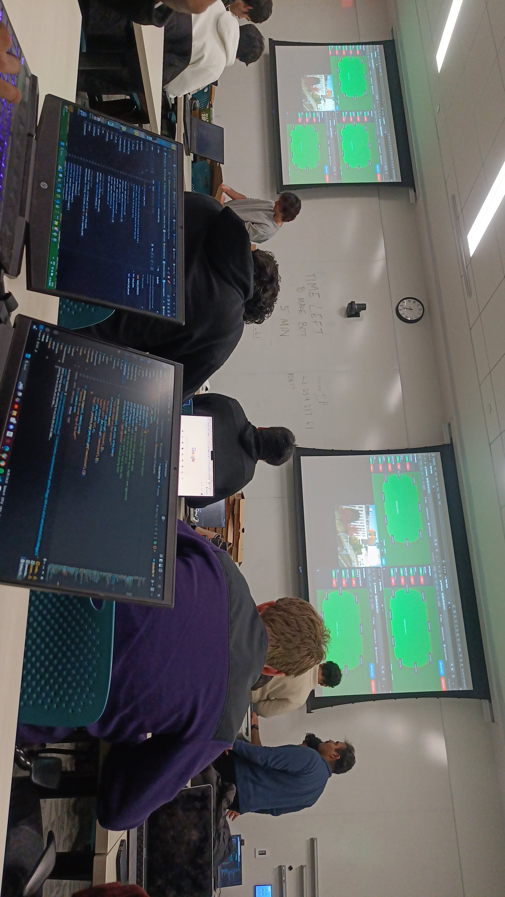

# 🃏 Algorithmic Poker Bot 🃏

  

## 🏆 2nd Place Winner - ACM Algorithmic Poker Event at Northeastern University, Boston

This poker bot secured 2nd place out of 18 competing teams at the Algorithmic Poker Event hosted by ACM at Northeastern University in collaboration with Code4Community and Disrupt. Developed by Aatmaj Salunke and Yaksh Shah, the bot was constructed in just 30 minutes yet implemented sophisticated poker strategies that outperformed most competitors.

  

## 🎯 Project Overview
Our algorithm combines game theory, probability analysis, and strategic decision-making to create an effective poker-playing bot. The competition required bots to make real-time decisions in Texas Hold'em poker games, evaluating hand strength, calculating odds, and making strategic bets against other algorithms.

## ✨ Key Features

### 📊 Pre-flop Hand Evaluation
* Evaluates starting hands to make optimal decisions based on hand quality

### 🎯 Position-Based Play
* Adapts strategy based on table position to maximize advantages

### 💰 Pot Odds Calculation
* Makes mathematically sound decisions by analyzing potential returns versus costs

### 📈 Dynamic Betting
* Varies bet sizes based on hand strength and pot size to maximize value

### 🏦 Stack-Based Adjustment
* Adjusts aggression and risk-taking based on current chip stack size

### 🎭 Selective Bluffing
* Strategically bluffs in favorable positions while avoiding high-risk situations

### 🧮 Win Probability Estimation
* Calculates winning chances at each stage to inform decision-making

### 📝 Tracking Functionality
* Records hand history to enable learning and strategy optimization

## 🛠️ Setup Instructions

### Setting Up Your Own Bot
Follow the instructions in [this repository](https://github.com/akala47/acm_pokerbot/tree/main) to set up your own poker bot.

### Setting Up the Poker Table System
For setting up the poker table system to test your bot, follow the instructions in [this repository](https://github.com/SpaceRage/node-poker-app).

## 🧠 Development Philosophy
This bot was created with the belief that successful poker AI requires balancing mathematical precision with strategic unpredictability. Our approach combines rigorous probability calculations with game theory optimal play, while maintaining enough variability to avoid becoming predictable to opponents.

## 🔗 Competition Details
The Algorithmic Poker Event challenges participants to develop poker-playing algorithms that combine elements of game theory, probability analysis, and artificial intelligence. Our bot competed against 17 other algorithms in a tournament-style format.

[Full Competition Rules](https://buttered-lupin-75d.notion.site/Algorithmic-Poker-Event-hosted-by-ACM-at-Northeastern-in-Collaboration-with-Code4Community-Disrupt--1a1b5df6bd4180838523cf0743b96813)

## 👨‍💻 Developers
- **Aatmaj Salunke** - [salunke.aa@northeastern.edu](mailto:salunke.aa@northeastern.edu)
- **Yaksh Shah** - [shah.yak@northeastern.edu](mailto:shah.yak@northeastern.edu)

## 🔮 Future Improvements
- Opponent modeling to adapt to different playing styles
- Machine learning integration for continuous improvement
- Enhanced bluffing strategies based on gathered opponent data
- Tournament-specific adjustments based on blind structure and payout considerations

---

Made with ❤️ 🃏 🤖 🏆 at the ACM Algorithmic Poker Mini Hackathon by Aatmaj and Yaksh....!!!
